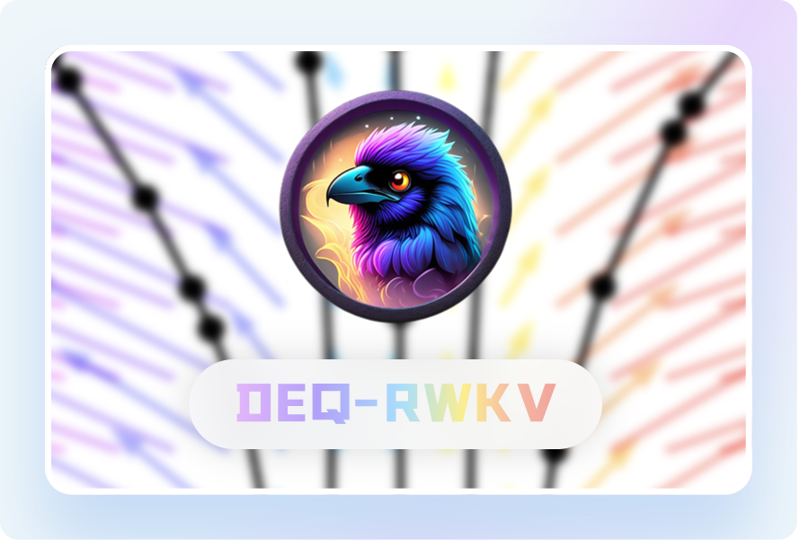

<div align="center">


# DEQ-RWKV

<div>
  
  
  
  
</div>
</div>

---

## 项目简介 🤔

**DEQ-RWKV** 是一个实验性开源项目，将 **深度均衡模型 (Deep Equilibrium Models, DEQ)** 与 **RWKV-v7** 架构相结合，探索更高效的序列建模方案。

### 核心思想

传统深度网络通过堆叠多层网络来提升表达能力，而 DEQ 通过寻找非线性方程的**不动点 (Fixed Point)** 来隐式定义无限层网络。本项目将 RWKV-v7 的 Block 作为 DEQ 的隐式层函数，通过 DEQ 求解器迭代寻找平衡状态。

### 主要优势

| 特性             | 说明                                                                        |
| ---------------- | --------------------------------------------------------------------------- |
| **显存优化**     | DEQ 特性只需存储一个 Block 的梯度，即可等效于多层网络，大幅降低训练显存占用 |
| **无限深度**     | 通过不动点迭代实现"无限层"效果，无需显式堆叠网络层                          |
| **RWKV-v7 架构** | 继承 RWKV-v7 的线性注意力机制，兼具 Transformer 的表达力和 RNN 的推理效率   |
| **CUDA 加速**    | 核心 WKV 计算使用 CUDA 实现，支持 GPU 加速训练和推理                        |

---

## 项目结构 📁

```
DEQ-RWKV/
├── main.py                 # 训练入口，包含训练模块和推理函数
├── main.ipynb              # Jupyter 笔记本，用于测试与学习
├── ops/                    # 核心算子模块
│   ├── model.py            # DEQ-RWKV 模型主体定义
│   ├── block.py            # RWKV Block，包含 Tmix 和 Cmix
│   ├── tmix.py             # Token Mixer，时间混合模块
│   ├── cmix.py             # Channel Mixer，通道混合模块
│   ├── wkv.py              # WKV 核心计算，支持 CPU/CUDA 后端
│   ├── tokenizer.py        # 分词器封装
│   └── cuda/               # CUDA 扩展源码
│       ├── rwkv7_clampw.cu     # CUDA 核函数实现
│       └── rwkv7_clampw.cpp    # CUDA 扩展绑定
├── data/                   # 数据处理模块
│   ├── dataset.py          # 数据集加载和预处理
│   └── test.jsonl          # 示例训练数据
├── tokenizer/              # 分词器配置
│   ├── tokenizer.json      # 分词器主配置
│   ├── tokenizer_config.json
│   └── special_tokens_map.json
├── pyproject.toml          # 项目依赖配置
└── README.md               # 项目文档
```

---

## 核心模块说明 📚

### 1. 模型架构 ([`ops/model.py`](ops/model.py:1))

[`Model`](ops/model.py:7) 类是 DEQ-RWKV 的主体，包含以下组件：

- **嵌入层**：将 token 索引映射为稠密向量
- **Block 层**：RWKV 核心计算单元，由 DEQ 求解器迭代调用
- **输出层**：LayerNorm + Linear 投影到词表空间

DEQ 求解器配置：
- **前向求解器**：Broyden 方法，支持自定义迭代次数和收敛阈值
- **反向求解器**：Broyden 方法，用于隐式层反向传播
- **隐式微分**：通过 `torchdeq` 库实现，自动处理不动点反向传播

### 2. RWKV Block ([`ops/block.py`](ops/block.py:6))

[`Block`](ops/block.py:6) 是 RWKV 的基本计算单元，包含两个子模块：

- **Tmix (Token Mixer)**：负责时间维度的信息混合，实现注意力机制
- **Cmix (Channel Mixer)**：负责通道维度的信息混合，实现前馈网络

**注意**：Cmix 不使用残差连接，实验发现该设计可避免 NaN 问题。

### 3. Token Mixer ([`ops/tmix.py`](ops/tmix.py:8))

[`Tmix`](ops/tmix.py:8) 实现 RWKV-v7 的时间混合机制，核心特性：

- **时间移位 (Time Shift)**：通过 [`nn.ZeroPad2d`](ops/tmix.py:64) 实现相邻时间步信息融合
- **LoRA 参数化**：衰减 (decay)、学习率 (a)、值 (v)、门控 (g) 均使用 LoRA 低秩适配
- **WKV 计算**：调用 [`wkv()`](ops/tmix.py:169) 执行核心注意力计算
- **组归一化**：使用特殊的 epsilon 值 (`64e-5`) 稳定训练

### 4. Channel Mixer ([`ops/cmix.py`](ops/cmix.py:5))

[`Cmix`](ops/cmix.py:5) 实现通道混合，结构简洁高效：

- **时间移位**：与 Tmix 类似，融合相邻时间步信息
- **深度嵌入 (Deep Embedding)**：根据输入 token 索引动态调整通道权重
- **平方 ReLU 激活**：使用 `square(relu(x))` 作为非线性激活

### 5. WKV 计算 ([`ops/wkv.py`](ops/wkv.py:1))

[`wkv()`](ops/wkv.py:91) 是 RWKV 的核心注意力算子，支持两种后端：

- **CPU 后端**：纯 PyTorch 实现，用于调试和无 GPU 环境
- **CUDA 后端**：自定义 CUDA 核函数，支持高效并行计算

---

## 快速开始 🚀

### 环境要求

- Python 3.12+
- PyTorch 2.10.0+
- CUDA 12.0+ (可选，用于 GPU 加速)
- uv 包管理器

### 安装依赖

```bash
# 使用 uv 安装依赖
uv sync
```

### 训练模型

```bash
# 启动训练
python main.py
```

训练配置在 [`main.py`](main.py:14) 的 [`Config`](main.py:14) 类中定义：

| 参数         | 默认值 | 说明             |
| ------------ | ------ | ---------------- |
| `n_embd`     | 384    | 嵌入维度         |
| `head_size`  | 64     | 注意力头大小     |
| `vocab_size` | 6400   | 词表大小         |
| `max_iter`   | 12     | DEQ 最大迭代次数 |
| `f_tol`      | 1e-6   | 不动点收敛阈值   |
| `lr`         | 3e-4   | 学习率           |
| `batch_size` | 10     | 批次大小         |
| `max_length` | 32     | 最大序列长度     |
| `epochs`     | 100    | 训练轮数         |

### 文本生成

```bash
# 使用训练好的模型生成文本
python main.py generate "你好，世界"
```

推理函数 [`generate()`](main.py:123) 支持以下参数：
- `prompt`：输入提示词
- `max_length`：最大生成长度
- `temperature`：采样温度（越高越随机）

---

## 数据格式 📊

训练数据使用 **JSONL** 格式，每行一个 JSON 对象：

```jsonl
{"text": "这是第一条训练数据"}
{"text": "这是第二条训练数据"}
```

[`TextDataset`](data/dataset.py:12) 会自动：
1. 使用 [`AutoTokenizer`](data/dataset.py:7) 将文本编码为 token
2. 截断或填充到指定长度
3. 构建输入 - 目标对（输入去掉最后一个 token，目标去掉第一个 token）

---

## 训练特性 ⚡

### Lightning 集成

项目使用 **PyTorch Lightning** 封装训练流程，提供以下特性：

- **自动混合精度**：支持 FP16/BF16 加速训练
- **梯度裁剪**：默认梯度范数限制为 0.5
- **检查点保存**：自动保存 Top-3 最优模型
- **学习率调度**：使用 [`ReduceLROnPlateau`](main.py:71) 根据验证损失动态调整学习率
- **日志记录**：训练日志自动保存到 `logs/` 目录

### 数据划分

[`create_dataloaders()`](data/dataset.py:53) 支持自动划分训练集和验证集：

```python
train_loader, val_loader = create_dataloaders(
    "data/test.jsonl",
    batch_size=10,
    max_length=32,
    val_split=0.1  # 10% 作为验证集
)
```

---

## 调试与测试 🧪

### WKV 单元测试

[`wkv.py`](ops/wkv.py:94) 包含完整的 CPU 后端测试代码：

```bash
python ops/wkv.py
```

测试内容：
- 前向传播数值稳定性检查（NaN/Inf 检测）
- 反向传播梯度有效性验证
- 输入输出形状校验

---

## 依赖说明 📦

项目依赖通过 [`pyproject.toml`](pyproject.toml:1) 管理：

| 依赖           | 版本     | 用途         |
| -------------- | -------- | ------------ |
| `torch`        | >=2.10.0 | 深度学习框架 |
| `lightning`    | >=2.6.1  | 训练流程封装 |
| `torchdeq`     | >=0.1.0  | DEQ 求解器   |
| `transformers` | >=4.30.0 | 分词器       |
| `numpy`        | >=2.4.2  | 数值计算     |
| `matplotlib`   | >=3.10.8 | 可视化       |

---

## 致谢 🙏

- [RWKV](https://github.com/BlinkDL/RWKV-LM) - RWKV 架构原作者
- [torchdeq](https://github.com/locuslab/deq) - DEQ 求解器实现
